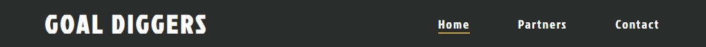
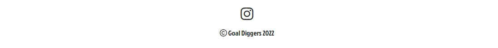
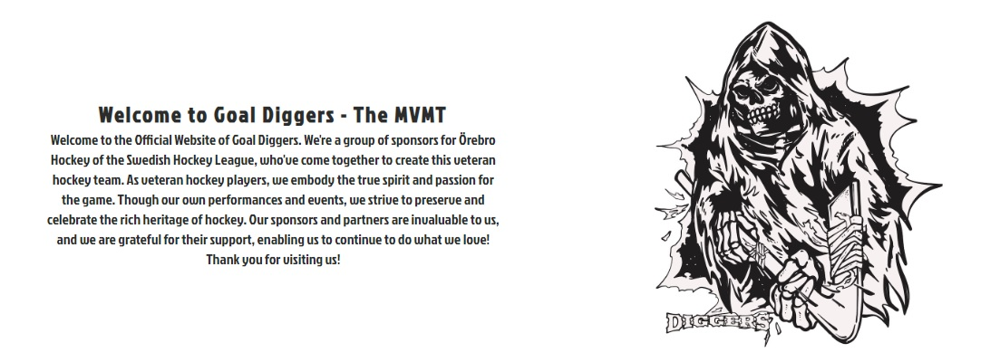
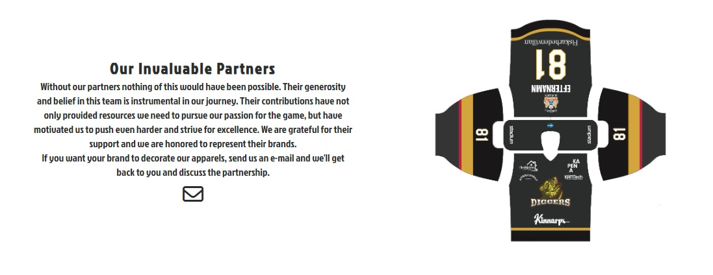
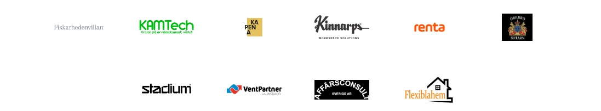
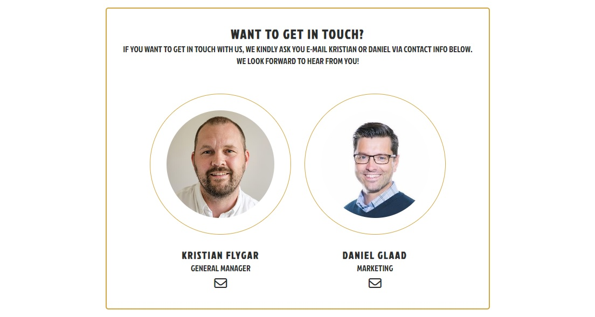
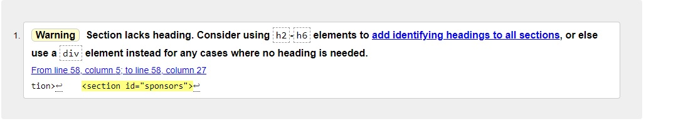
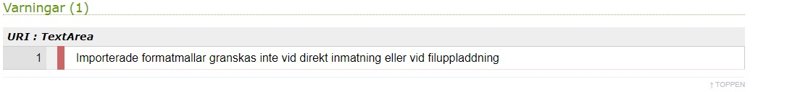

# Goal Diggers Website
This website is a plattform for our fans and partners to get familiar with our team. It's also a plattform for veteran tournaments to be able to invite the team to their upcoming events.

        Mockup image
---
## Features
The website has 3 pages: Home, Partners and Contact. in the future there may be more. 

### **Navbar**

All three pages has a navbar in which you can browse through the pages. I added a logo on the top left which links to "Home"-page. The menu has a hover effect which highlights hovered element with the same color as the gold-part of our apparels, with an active 2px line showing the user which page is active.

### **Footer**

In the footer I've added a link to our Instagram page with a hover affect that turns the icon into the golden color of our apparels.

### **Home page**

The landing page informs the user who the Goal Diggers are and how they came around. Goal Diggers logoype floats to the right side of the page to add some style.

### **Partners page**

On the Partners page we show some gratitude for our partners/sponsors who have made it possible to create this hockey team.
We also have a link that sets up an e-mail to our genereal manager if the user is interested in becoming a partner to the team. 
On the right hand side we hade a image of our apparel that shows the user how the teams jersey look.

Below this section we have a gallery of logotypes of the teams current sponsors, each one with a direct link to their own websites. To highlight the hovered logotype we added an increasing effect.

### **Contact page***

On the contact page the user gets familiar on who they can contact if they e.g wants to invite the team to a tournament or have any other questions they want to ask.

We've added som styling to the images and a link to an e-mail within the envelope icon, which is turning in to the golden color when hovered.

### **Features for the future**
Here are soma of the features that will be added in the future:
* Adress/map to the office under contact page.
* Webshop page with Goal Diggers merchandise.
* Tournaments page (when the team has participated in more than one) with statistics.
* Roster page with information and statistcs of the players.
---
## Testing
The website has been tested several times on W3 Validator during the development 
with good result along the way.
All features works as I want them to on different plattforms. 

The **navbar** is decreasing evenly when decreasing the screensize. The menu moves 
down below the logotype on small screens.
The hover and active effekt on the menu is tested on multipal computers.

The **footer** is fixed at the bottom of the page and works well across all pages 
of the website. Testing has been done several times to get in the right spot relative 
to the other content on each page.

The content of **Home**, **Partners** and **Contact** page is divided into sections 
using flexbox and was tricky to make it look good and behave the way I wanted when decreasing 
the screen size. Testing have been done using DevTools to find the right properties 
and values.

### **Validator testing**
The **HTML** code is tested in W3 Validator and passed with only one warning:

* The **Sponsors** page is missing a heading in the <section> on line 58, which 
is the section with the logotypes of our sponsors, where I do not want a heading 
to be visible for the users.
* Result

The **CSS** code is tested in Jigsaw Validator and also passed with only one warning
referring to the imort of font style from Google Fonts.

*Waring:*

*Result;*

### **Unfixed bugs**
No bugs detected.

---

## **Deployment**

        Fill this section

---

## **Credits**
Inspiration to the websites lay out comes from Love running combined with [Kapena's Website](www.kapena.se). 
I've used parts of Love Runnings code on the navbar and on the images on the contact page.
I've used the idea of Kapena's lay out with the separeted page where the text kontent 
is on one side and a picture on the other.

* Fonts where imported from Google Fonts
* Icons where imported from Font Awesome

### Media
* Logotypes on Partners page where gathered from each website:
  - [Kapena](https://www.kapena.se)
  - [Fiskarhedenvillan](https://www.fiskarhedenvillan.se)
  - [Kamtech](https://www.kamtech.se)
  - [Kinnaprs](https://www.kinnars.se)
  - [Renta](https://www.resta.se)
  - [Örebro Sotarn](https://www.orebrosotarn.se)
  - [Stadium](https://www.stadium.se)
  - [VentPartner](https://www.ventpartner.se)
  - [Affärsconsult](https://www.affarsconsult.se)
  - [FlexiblaHem](https://www.flexiblahem.se)
* Images on contact page where gathered from:
  - [Kapena](https://www.kapena.se/kontakt)
  - [Fiskarhedenvillan](https://www.fiskarhedenvillan.se/kontor/orebro/)
* Colors generated from: 
  - [ImageColorPicker](https://imagecolorpicker.com/)

References

Inspiration: Kapena.se
Structure and code: Love Running, CI challenges
Images "Partners": all websites

Icons: Font Awesome
Fonts: Google Font
